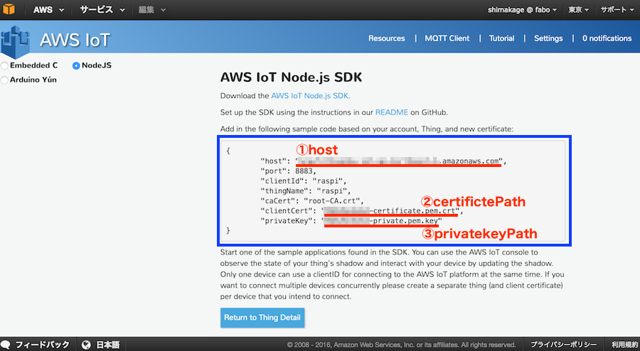
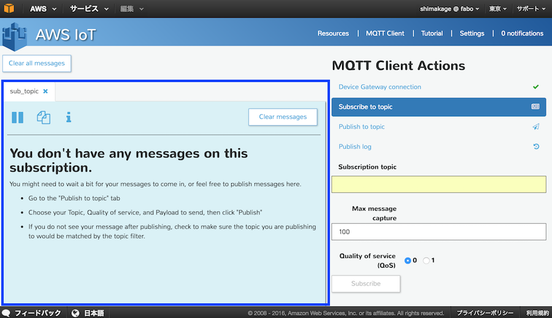
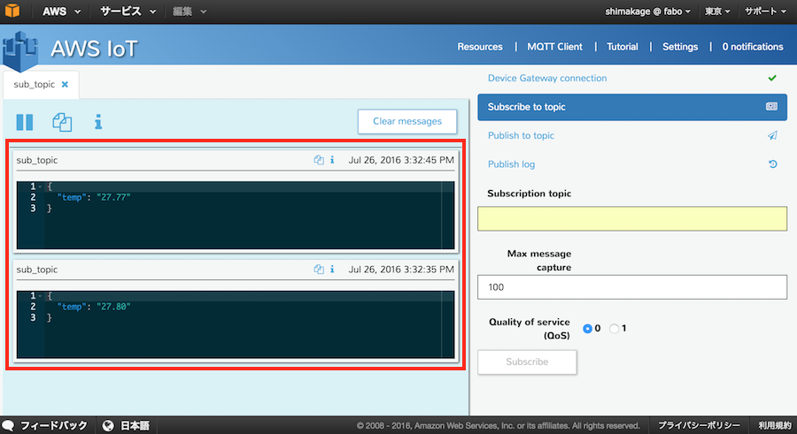

## 温度センサーの値を同期(Python）

I2Cの温度センサーから温度を取得し、その値をAWS IoT側に送信します。

今回送信したデータはMQTT Clientにて確認を行っていきます。

### Out/In Shieldと温度センサーの接続
RaspberryPIにOut/In Shieldを取り付けます。

Out/In ShieldのI2Cコネクタに#207 Temperature i2c Brickを接続します。

**※I2Cセンサーを使用する場合、事前にいくつかの設定を行う必要があります。**

**下記の「I2CとSPIの有効化の設定方法」を参考に設定を行って下さい。
**

https://fabo.gitbooks.io/module/content/502_shield_outin_raspberrypi.html

### AWS IoT Device SDK for Pythonのインストール

まずPythonでAWSにデータを登録するために必要な、AWS IoT Device SDKをインストールします。SDKはpipを使用してインストールします。

ターミナルを起動し、下記のコマンドを実行します。

```
sudo pip install AWSIoTPythonSDK
```

### 温度センサー用ライブラリのインストール
次に温度センサーから温度を取得するためのライブラリをインストールします。

下記のコマンドを実行してインストールします。

```
sudo pip install FaBoTemperature_ADT7410
```


### 証明書ファイルの準備
サンプルコード実行にあたり、証明書のファイルが３つ必要になります。

RaspberryPIにて、今回ファイルを格納するフォルダ「aws」を作成します。

PC側でAWSIoTで作成した証明書ファイル等が入ったkeyフォルダをRaspberryPIに移動しま。。

####macの場合
Keyフォルダが存在する場所まで移動し、以下のコマンドを実行
```
scp -rC key pi@xxx.xxx.xxx.xxx:/aws
```


次に、ルート証明書ファイルを取得します。

RaspberryPIにてkeyフォルダに移動し、下記コマンドによりファイルを作成します。

```
curl https://www.symantec.com/content/en/us/enterprise/verisign/roots/VeriSign-Class%203-Public-Primary-Certification-Authority-G5.pem -o rootCA.pem
```

rootCA.pemという名前で保存されます。

#### ディレクトリ構成

```
aws/
  └ key/
      ├ xxxxxxxxxx-certificate.pem.crt (ダウンロードしたSSL証明書)
      ├ xxxxxxxxxx-private.pem.key     (プライベートキー)
      └ rootCA.pem                     (コマンドにて取得したルート証明書)
```


## サンプルコード準備
awsフォルダ内にサンプルコード「aws_temp.py」を作成します。

16行目〜21行目にある①host、②certificatePath、③privateKeyPathの項目には「XXXXXX」で記載している箇所があります。


ここは接続設定時の下の画面の時に退避しておいたテキストに合わせて変更して下さい。



<br>

### aws_temp.py

```python
#!/usr/bin/env python
# coding: utf-8

from AWSIoTPythonSDK.MQTTLib import AWSIoTMQTTClient
import logging
import time
import json

# I2C 温度センサ用ライブラリ
import FaBoTemperature_ADT7410

# 温度取得用のオブジェクト
adt7410 = FaBoTemperature_ADT7410.ADT7410()

# ① Host設定 AWS IoTのThingのホスト名
host            = "XXXXXXXXXXXXXXXXXX-1.amazonaws.com"
# ② certificateのパス設定
certificatePath = "./key/XXXXXXXXXX-certificate.pem.crt"
# ③ private Keyのパス設定
privateKeyPath  = "./key/XXXXXXXXXX-private.pem.key"
# rootCAのパス設定
rootCAPath      = "./key/rootCA.pem"

# Configure logging
logger = None
logger = logging.getLogger("AWSIoTPythonSDK.core")  # Python 2
logger.setLevel(logging.DEBUG)
streamHandler = logging.StreamHandler()
formatter = logging.Formatter('%(asctime)s - %(name)s - %(levelname)s - %(message)s')
streamHandler.setFormatter(formatter)
logger.addHandler(streamHandler)

# Init AWSIoTMQTTClient
myAWSIoTMQTTClient = None
# Thingに設定した名前
myAWSIoTMQTTClient = AWSIoTMQTTClient("raspi")
# Endpoint
myAWSIoTMQTTClient.configureEndpoint(host, 8883)
# 証明書のパス
myAWSIoTMQTTClient.configureCredentials(rootCAPath, privateKeyPath, certificatePath)

# AWSIoTMQTTClient connection configuration
myAWSIoTMQTTClient.configureAutoReconnectBackoffTime(1, 32, 20)
myAWSIoTMQTTClient.configureOfflinePublishQueueing(-1)  # Infinite offline Publish queueing
myAWSIoTMQTTClient.configureDrainingFrequency(2)  # Draining: 2 Hz
myAWSIoTMQTTClient.configureConnectDisconnectTimeout(10)  # 10 sec
myAWSIoTMQTTClient.configureMQTTOperationTimeout(5)  # 5 sec

# Connect and subscribe to AWS IoT
myAWSIoTMQTTClient.connect()
time.sleep(2)

while True:
    # 温度データ取得
    temp = "{0:.2f}".format(adt7410.read())
    # 送信データ設定
    record = {
        "temp": temp
    }
    # データ変換
    jstr = json.dumps(record)
    # データ送信 MQTT Clientで設定したSubscribe topic名を指定
    myAWSIoTMQTTClient.publish("sub_topic", str(jstr), 1)
    # 送信データのログ出力
    print jstr

    time.sleep(10)

```

### 実行

実行前のディレクトリ構成はこのようになります。

```
aws/
  ├ aws_temp.py (サンプルプログラム）
  └ key/
      ├ xxxxxxxxxx-certificate.pem.crt (ダウンロードしたSSL証明書)
      ├ xxxxxxxxxx-private.pem.key     (プライベートキー)
      └ rootCA.pem                     (コマンドにて取得したルート証明書)
```

実行する前にMQTT　Client Actionの画面を開いておきます。
もし閉じてしまった場合はもう一度同様の内容で作成して下さい。




awsフォルダに移動し、下記のコマンドによりサンプルコードを実行します。

```
python aws_temp.py
```

実行後、いくつかログ表示されたあと、下記のようなログが表示されます。

```
{"temp": "XX.XX"}
```

このログが２回ほど表示されたら、Controlキー＋Cで処理を終了します。


### 結果確認

AWS IoTのMQTT Clientの画面から、今回送信した温度データを確認することができます。



### 補足
今回はAWS側にデータを送りましたが、AWS側でデータを受け取ることもできます。

AWS SDKのサンプルコードの「subscribe」の箇所を参考にしてください。

#####参考
AWS_SDK samples/basicPubSub

https://github.com/aws/aws-iot-device-sdk-python