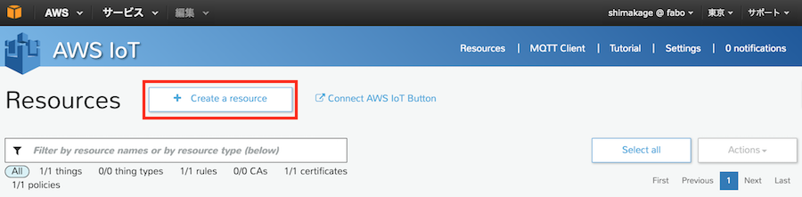
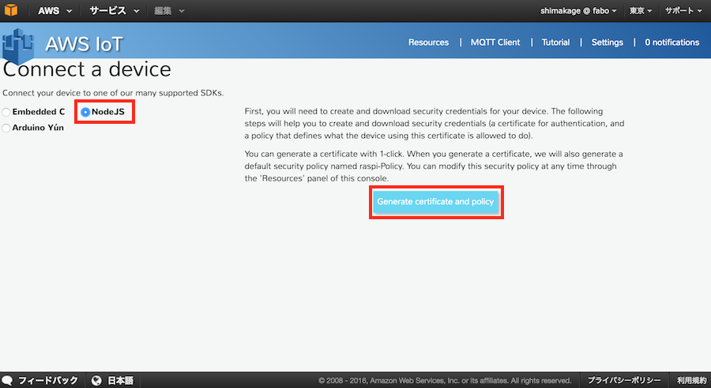
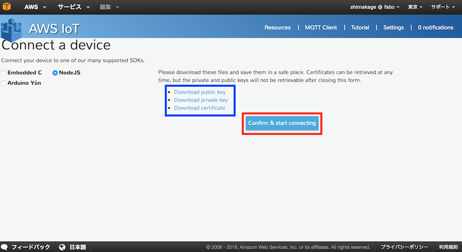
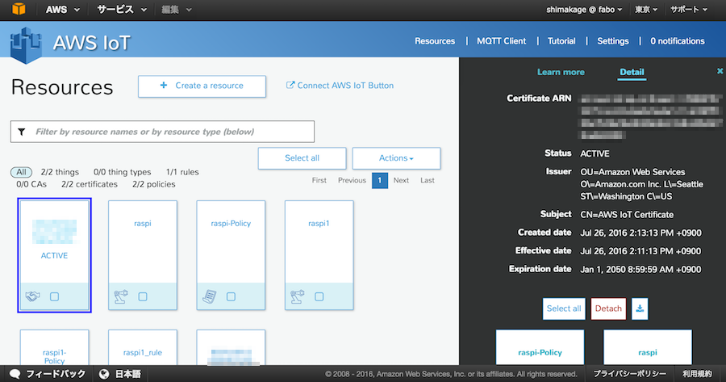

# デバイスの登録 (Python)

## AWS IoTの設定
AWSマネジメントコンソールから設定していきます。

下記URLよりコンソールへサインインボタンをクリックしログインを行います。

AWS

https://aws.amazon.com/jp/

### Thingの作成
まず始めにThing(デバイス)の作成を行います。

HOME画面のタイムゾーンが東京になっていることを確認し、「AWS IoT」を選択してAWS IoTの画面に遷移します。

 

AWS IoTの設定画面が表示されました。

ここで「Create a resource」ボタンを押すことによりいくつかのアイコンが表示されます。

ここの一番左の「Create a Thing」をクリックします。

表示されたNameの項目にThing名を入力して「Create」ボタンをクリックします。

これでThingが作成されました。

 

### デバイス認証設定

Thingに対してデバイスからの認証情報の設定を行います。

AWS IoTの画面からThingを選択し、表示された詳細から「Connect a device」をクリックします。

ここでは今回使用するPythonが存在しないので、代わりに「NodeJS」を選択します。

選択後、ボタンが表示されるので記述内容を確認し「Generate certificate and policy」をクリックします。

表示された３つのリンクよりファイルをダウンロードします。

ダウンロードするファイル

|ファイル名|説明|
|:--|:--|
|XXXXXXXXXX-public.pem.key|公開キー|
|XXXXXXXXXX-private.pem.key|秘密キー|
|XXXXXXXXXX-certificate.pem.crt|証明書|

※certificateは後からダウンロードできますが、Publick KeyとPrivate Keyはここでしかダウンロードすることができません。

忘れずにダウンロードしてください。

ダウンロードが完了したら「Confirm & start connecting」をクリックします。

 

次に表示されたテキストボックスの内容は接続時に使用するものになりますので、テキストボックスの内容をコピーして別ファイルに貼り付けて保存しておきます。

それが終わりましたらReturn to Thing Detailボタンを押します。

### MQTT Client設定

次にMQTT Clientの設定を行います。
ここではデータの受信や送信を行うことができます。

AWS IoTの画面から「MQTT Client」を選択します。

MQTT Client Actionsの画面が表示されるので、Device Getway connectionを選択し、Crient IDを入力します。

入力が終わったら「Connect」ボタンをクリックし、接続を行います。

Client ID「Client」が接続されました。

次にメッセージを受け取る設定を行います。

Subscription topicを選択し、topic名、Maxメッセージ数を設定します。受け取ったメッセージ数がMaxメッセージ数を超えた場合、古いメッセージから順に上書きしていきます。

入力が終わったら「Subscribe」ボタンをクリックします。

画面左側に今回作成した「sub_topic」が表示されました。

これで設定は完了となります。