## LED制御(Python）

ここではThing Shadowを使ってLEDの制御を行っていきます。

## Thing Shadowとは

デバイスと管理アプリの状態を同期させる機能としてThing Shadowというものがあります。

これはデバイス（Thing）の状態と、AWS側で保持しているデバイスの状態（Thing Shadow)の２つを保持しており、どちらかに変更があった場合、その値をもう片方に反映させることができます。

これを利用することで、管理アプリからAWS側の状態を変更することによりデバイスを制御することができます。

### Device Shadowの設定

AWS IoTの画面に移動し、対象のthingを選択します。

画面右側に詳細が表示されるので、「Update Shadow」タブを選択します。

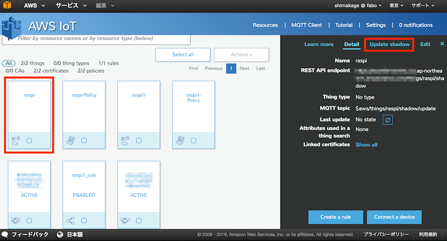

Shadow stateという項目が表示されました。
ここのdesiredとreportedの項目を設定していきます。

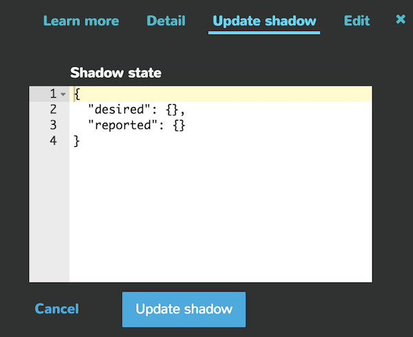

それぞれの意味は下のようになります。

|項目|意味|
|:--|:--|
|desired|AWS側の状態|
|reported|thingの状態|

<br>

今回はLEDを制御するため、項目名を"led"、設定値を0(消灯)にします。
desiredとreportedには同様の値を設定して下さい。

入力が終わったら「Update shadow」ボタンをクリックします。

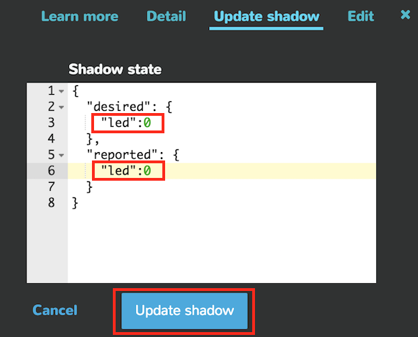

更新を行うと「shadow status」に「In sync」が表示されます。

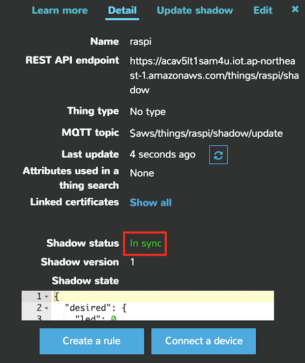

下にスクロールしていくと、設定した内容と更新を行った時間が表示されます。

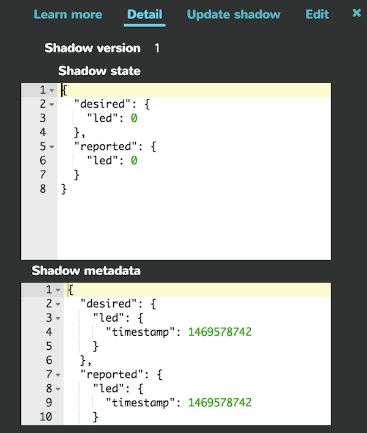

AWS側の設定は以上となります。

### Out/In ShieldとLEDの接続
RaspberryPIにOut/In Shieldを取り付けます。

Out/In ShieldのGPIO4コネクタに#101 LED Brickを接続します。

### 証明書ファイルの準備

温度センサの同期で準備したファイルをそのまま使用します。

※温度センサの時と別のthingで作成した場合は用意する必要があります。

#### ディレクトリ構成

```
aws/
  └ key/
      ├ xxxxxxxxxx-certificate.pem.crt (ダウンロードしたSSL証明書)
      ├ xxxxxxxxxx-private.pem.key     (プライベートキー)
      └ rootCA.pem                     (コマンドにて取得したルート証明書)
```

### サンプルプログラムの準備

```python
#!/usr/bin/env python
# coding: utf-8

from AWSIoTPythonSDK.MQTTLib import AWSIoTMQTTShadowClient
import sys
import logging
import time
import json
import getopt

import RPi.GPIO as GPIO

#LED PIN(GPIO)
LED_PIN = 4

GPIO.setwarnings(False)
GPIO.setmode(GPIO.BCM)
GPIO.setup(LED_PIN, GPIO.OUT)

# ① Host設定 AWS IoTのThingのホスト名
host            = "XXXXXXXXXXXXXXXXXX-1.amazonaws.com"
# ② certificateのパス設定
certificatePath = "./key/XXXXXXXXXX-certificate.pem.crt"
# ③ private Keyのパス設定
privateKeyPath  = "./key/XXXXXXXXXX-private.pem.key"
# rootCAのパス設定 取得した証明書のパス
rootCAPath      = "./key/rootCA.pem"

# 変更データ受信時の処理
class shadowCallbackContainer:
    def __init__(self, deviceShadowInstance):
        self.deviceShadowInstance = deviceShadowInstance

    # Custom Shadow callback
    def customShadowCallback_Delta(self, payload, responseStatus, token):
        # payload is a JSON string ready to be parsed using json.loads(...)
        # in both Py2.x and Py3.x
        print("Received a delta message:")
        payloadDict = json.loads(payload)

        deltaMessage = json.dumps(payloadDict["state"])

        print(deltaMessage)

        # LED制御
        try:
            # ledの値を取得
            state = int(payloadDict["state"]["led"])
            # led出力(0:消灯、1:点灯)
            GPIO.output(LED_PIN, state)
        except:
            print "LED ERROR"

        # reportedの更新
        newPayload = '{"state":{"reported":' + deltaMessage + '}}'
        self.deviceShadowInstance.shadowUpdate(newPayload, None, 5)
        print("Sent.")

# Configure logging
logger = None
logger = logging.getLogger("AWSIoTPythonSDK.core")  # Python 2
logger.setLevel(logging.DEBUG)
streamHandler = logging.StreamHandler()
formatter = logging.Formatter('%(asctime)s - %(name)s - %(levelname)s - %(message)s')
streamHandler.setFormatter(formatter)
logger.addHandler(streamHandler)

# Init AWSIoTMQTTShadowClient
myAWSIoTMQTTShadowClient = None

# Thingに設定した名前
myAWSIoTMQTTShadowClient = AWSIoTMQTTShadowClient("ThingShadowEcho")
# Endpoint
myAWSIoTMQTTShadowClient.configureEndpoint(host, 8883)
# 証明書のパス
myAWSIoTMQTTShadowClient.configureCredentials(rootCAPath, privateKeyPath, certificatePath)

# AWSIoTMQTTShadowClient configuration
myAWSIoTMQTTShadowClient.configureAutoReconnectBackoffTime(1, 32, 20)
myAWSIoTMQTTShadowClient.configureConnectDisconnectTimeout(10)  # 10 sec
myAWSIoTMQTTShadowClient.configureMQTTOperationTimeout(5)  # 5 sec

# Connect to AWS IoT
myAWSIoTMQTTShadowClient.connect()

# Create a deviceShadow with persistent subscription
Bot = myAWSIoTMQTTShadowClient.createShadowHandlerWithName("raspi", True)
shadowCallbackContainer_Bot = shadowCallbackContainer(Bot)

# Listen on deltas
Bot.shadowRegisterDeltaCallback(shadowCallbackContainer_Bot.customShadowCallback_Delta)

print "READY"

# Loop forever
while True:
    pass

```

### pythonプログラム実行

実行前のディレクトリ構成はこのようになります。

```
aws/
  ├ aws_led.py (サンプルプログラム）
  └ key/
      ├ xxxxxxxxxx-certificate.pem.crt (ダウンロードしたSSL証明書)
      ├ xxxxxxxxxx-private.pem.key     (プライベートキー)
      └ rootCA.pem                     (コマンドにて取得したルート証明書)
```

実行すると「Ready」が表示されれば準備が完了です。

### LED制御

AWS IoT側からLEDの制御を行います。

対象となるthingを選択し、詳細の「Update shadow」を選択します。

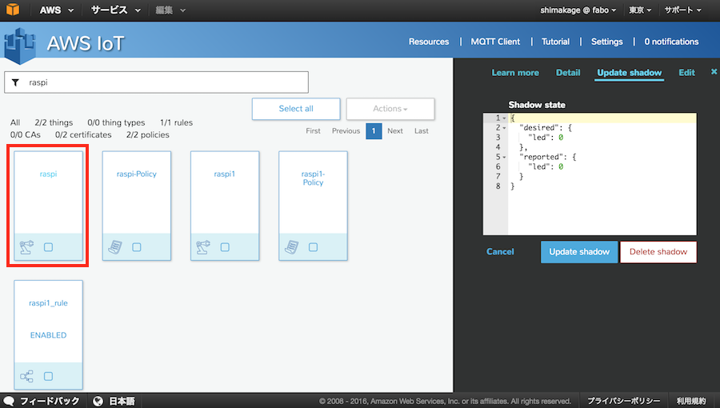

ここで、"desired"の"led"の値を1に変更し、「Update shadow」ボタンをクリックします。

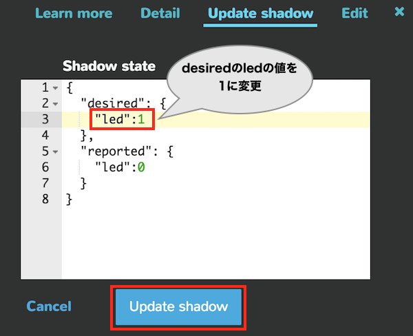

Datailタブを選択し、「Shadow status」が「In sync」となっていることを確認します。

成功するとここでLEDが点灯します。
点灯しない場合はthing名があっているか、LEDが正しく接続されているか(サンプルではGPIO4)などを確認して下さい。

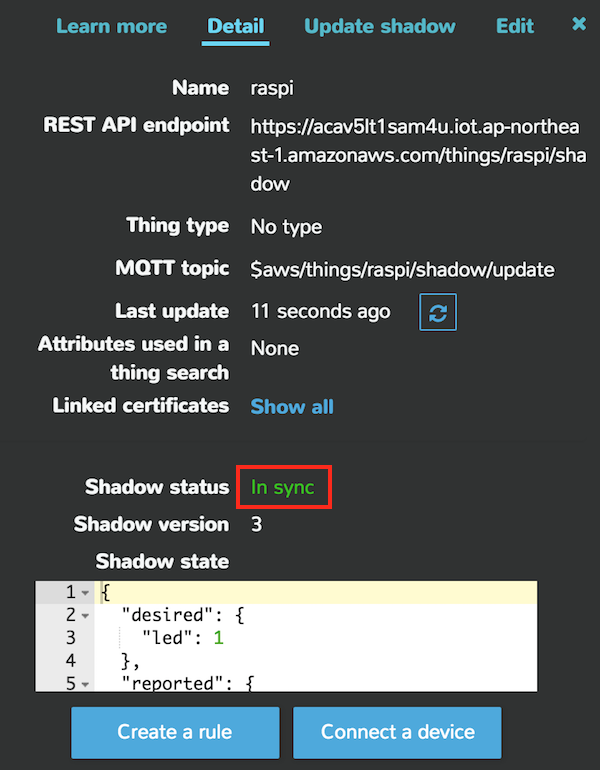

下にスクロールしていくと"reported"の"led"の値が1に変更されていることを確認できます。

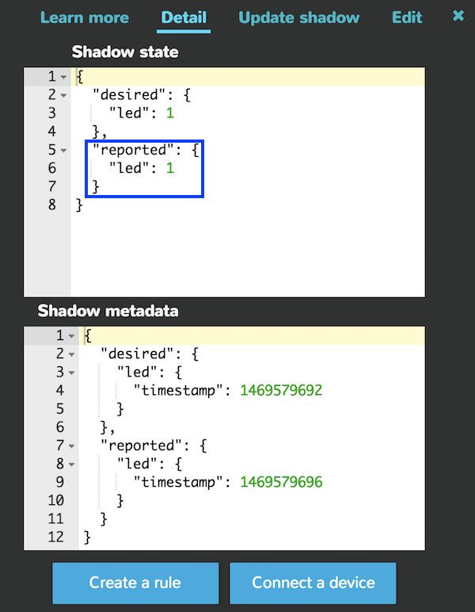

次にLEDの消灯を行います。

thingからUpdate shadowを選択します。
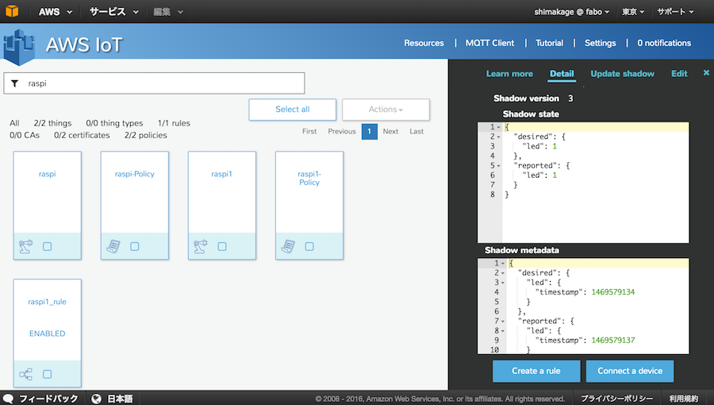

"desired"の"led"の値を0に変更し、「Update shadow」ボタンをクリックします。
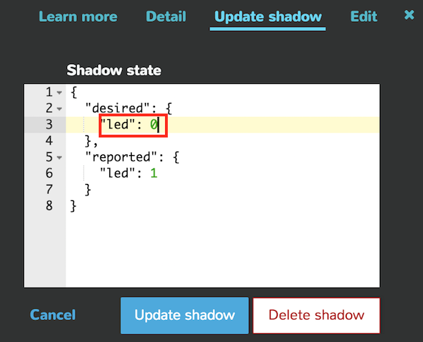

先ほどと同様に"reported"の値が0に更新され、LEDが消灯します。
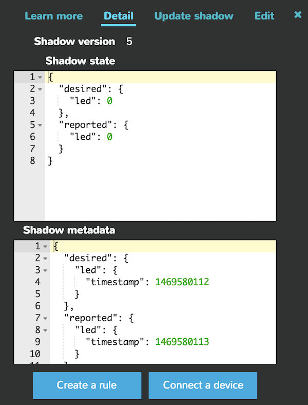
