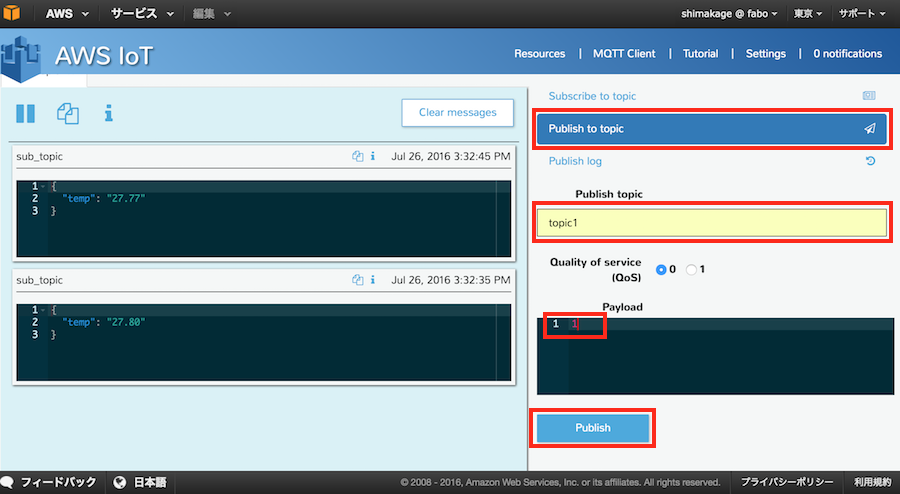
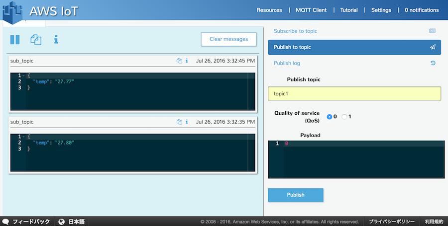

## LED制御(Python）

次にMQTT ClientからLEDの点灯/消灯の制御を行います。


### Out/In ShieldとLEDの接続
RaspberryPIにOut/In Shieldを取り付けます。

Out/In ShieldのGPIO4コネクタに#101 LED Brickを接続します。

### 証明書ファイルの準備

温度センサの同期で準備したファイルをそのまま使用します。

#### ディレクトリ構成

```
aws/
  └ key/
      ├ xxxxxxxxxx-certificate.pem.crt (ダウンロードしたSSL証明書)
      ├ xxxxxxxxxx-private.pem.key     (プライベートキー)
      └ rootCA.pem                     (コマンドにて取得したルート証明書)
```


## サンプルコード準備
awsフォルダ内にサンプルコード「aws_led.py」を作成します。

温度センサの時と同様に、18行目〜22行目にある①host、②certificatePath、③privateKeyPathの項目には「XXXXXX」で記載している箇所を変更して下さい。

### aws_temp.py

```python
#!/usr/bin/env python
# coding: utf-8

from AWSIoTPythonSDK.MQTTLib import AWSIoTMQTTClient
import logging
import time
import json

import RPi.GPIO as GPIO

LED_PIN = 5

GPIO.setwarnings(False)
GPIO.setmode(GPIO.BCM)
GPIO.setup(LED_PIN, GPIO.OUT)

# ① Host設定 AWS IoTのThingのホスト名
host            = "XXXXXXXXXXXXXXXXXX-1.amazonaws.com"
# ② certificateのパス設定
certificatePath = "./key/XXXXXXXXXX-certificate.pem.crt"
# ③ private Keyのパス設定
privateKeyPath  = "./key/XXXXXXXXXX-private.pem.key"
# rootCAのパス設定 取得した証明書のパス
rootCAPath      = "./key/rootCA.pem"

# MQTT message 受信時の処理
def customCallback(client, userdata, message):
        print("Received a new message: ")
        print(message.payload)
        print("from topic: ")
        print(message.topic)
        try:
            a = message.payload
            if a == "1":
                GPIO.output(LED_PIN, True)
            else:
                GPIO.output(LED_PIN, False) 
        except:
            print "LED ERROR"
        print("--------------\n")

# Configure logging
logger = None
logger = logging.getLogger("AWSIoTPythonSDK.core")  # Python 2
logger.setLevel(logging.DEBUG)
streamHandler = logging.StreamHandler()
formatter = logging.Formatter('%(asctime)s - %(name)s - %(levelname)s - %(message)s')
streamHandler.setFormatter(formatter)
logger.addHandler(streamHandler)

# Init AWSIoTMQTTClient
myAWSIoTMQTTClient = None
# Thingに設定した名前
myAWSIoTMQTTClient = AWSIoTMQTTClient("raspi")
# Port
myAWSIoTMQTTClient.configureEndpoint(host, 8883)
# 証明書のパス
myAWSIoTMQTTClient.configureCredentials(rootCAPath, privateKeyPath, certificatePath)

# AWSIoTMQTTClient connection configuration
myAWSIoTMQTTClient.configureAutoReconnectBackoffTime(1, 32, 20)
myAWSIoTMQTTClient.configureOfflinePublishQueueing(-1)  # Infinite offline Publish queueing
myAWSIoTMQTTClient.configureDrainingFrequency(2)  # Draining: 2 Hz
myAWSIoTMQTTClient.configureConnectDisconnectTimeout(10)  # 10 sec
myAWSIoTMQTTClient.configureMQTTOperationTimeout(5)  # 5 sec

# Connect and subscribe to AWS IoT
myAWSIoTMQTTClient.connect()
# データ受信時の設定 Publish topicに設定するtopicを指定
myAWSIoTMQTTClient.subscribe("topic1", 1, customCallback)
time.sleep(2)

try:
    while True:
        pass

except KeyboardInterrupt:
    GPIO.cleanup()

```

### 実行

実行前のディレクトリ構成はこのようになります。

```
aws/
  ├ aws_led.py (サンプルプログラム）
  └ key/
      ├ xxxxxxxxxx-certificate.pem.crt (ダウンロードしたSSL証明書)
      ├ xxxxxxxxxx-private.pem.key     (プライベートキー)
      └ rootCA.pem                     (コマンドにて取得したルート証明書)
```

awsフォルダに移動し、下記のコマンドによりサンプルコードを実行します。

```
python aws_led.py
```


### 結果確認

AWS IoTのMQTT Clientの画面からデータの送信を行います。

Publish to topicを選択し、Publish topicにtopic名、Payloadに1を設定し、「Publish」ボタンをクリックします。

|項目|説明|設定値|
|:--|:--|:--|
|Publish topick|データを送信(publish)するtopic|topick1|
|QoS|サービス品質|0(変更なし)|
|Payload|送信データ|0|



「Publish」ボタンをクリックすることで、RaspberryPiに接続したLEDが点灯します。


<br>


次はLEDを消灯させます。

先ほどと同様の内容でPayloadの値のみ「0」に変更し、「Publish」ボタンをクリックします。



これでLEDが消灯しました。