# デバイスの登録 (Python)

## AWS IoTの設定
AWSマネジメントコンソールから設定していきます。

下記URLよりコンソールへサインインボタンをクリックしログインを行います。

AWS
https://aws.amazon.com/jp/

### Thingの作成
まず始めにThing(デバイス)の作成を行います。

HOME画面のタイムゾーンが東京になっていることを確認し、「AWS IoT」を選択してAWS IoTの画面に遷移します。

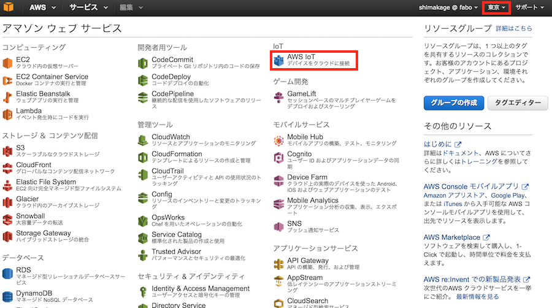

 

AWS IoTの設定画面が表示されました。

ここで「Create a resource」ボタンを押すことによりいくつかのアイコンが表示されます。

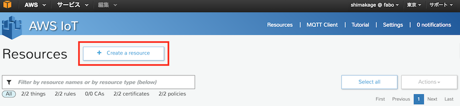

 

ここの一番左の「Create a Thing」をクリックし、表示されたNameの項目にThing名を入力して「Create」ボタンをクリックします。

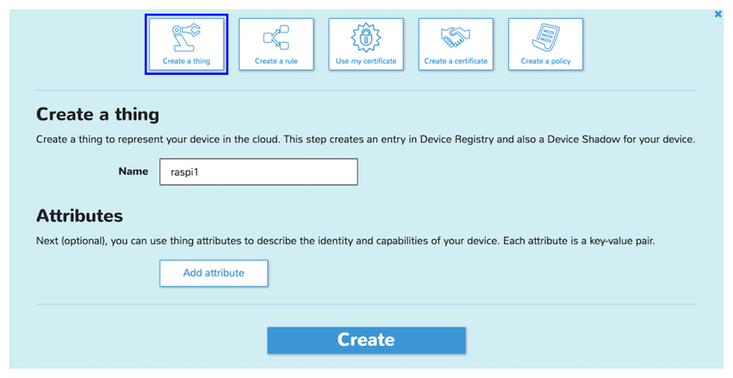

これでThingが作成されました。

 

### Ruleの作成
次にThingに対するルールを作成します。

ここではThingからデータを取得する条件、取得後のアクションなどを設定していきます。

AWS IoTの画面から先ほど作成したThingを選択することで右側に詳細が表示されるので、その下にある「Create rule」ボタンを押します。

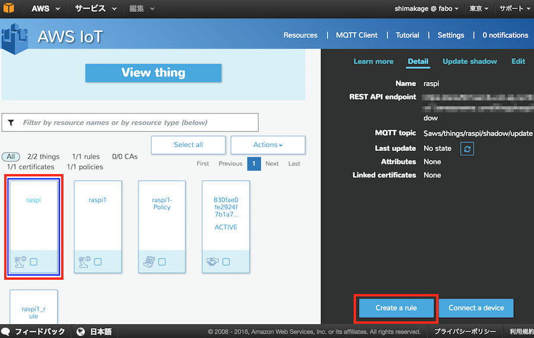

ルールの作成画面が表示されます。

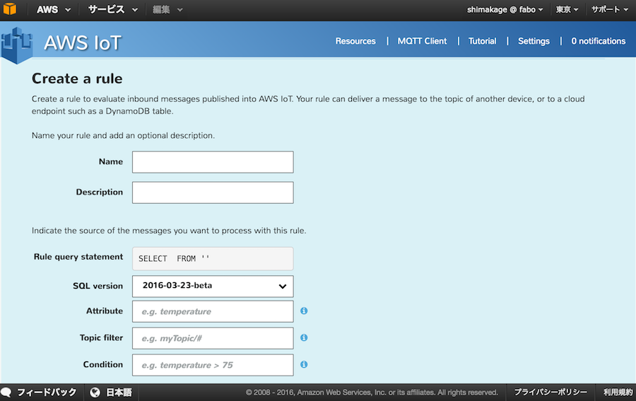

#### 取得条件の設定
まずはルール名、取得条件を設定します。

今回は「/test/temp」というTopicへデータを送信するため、Topic filterにはこのように設定します。

 

各項目の説明

|項目|説明|設定値|
|:--|:--|:--|
|Name|ルール名|raspi_rule|
|Description|ルールに対するコメント|raspi_test|
|SQL version|SQLのバージョン|2016-03-23-beta(変更なし)|
|Attribute|取得する項目|*|
|Topic filter|取得するTopic|/test/temp|
|Condition|取得する条件|未設定|

 

#### Actionの設定

画面を下にスクロールするとChoose an actionがあります。

ここは受け取ったデータに対してどのようなアクションをするかを設定する箇所になります。

今回は取得したデータをDainamoDBのテーブルにデータを作成していくような設定にするため、「DynamoDB」を選択します。

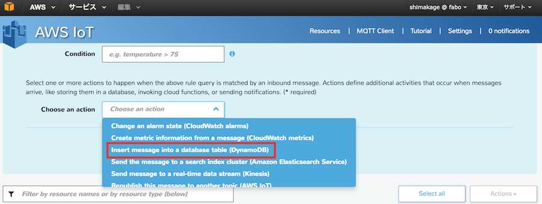

項目の説明

|項目|説明|設定値|
|:--|:--|:--|
|choose an action|データ取得後のアクション|Insert message into a database table (DynamoDB)|

 

DynamoDBを選択すると、テーブル名を入力する項目が表示されます。

この時点ではテーブルが存在しないため、項目の右にある「Create a new resource」からテーブルの作成を行います。

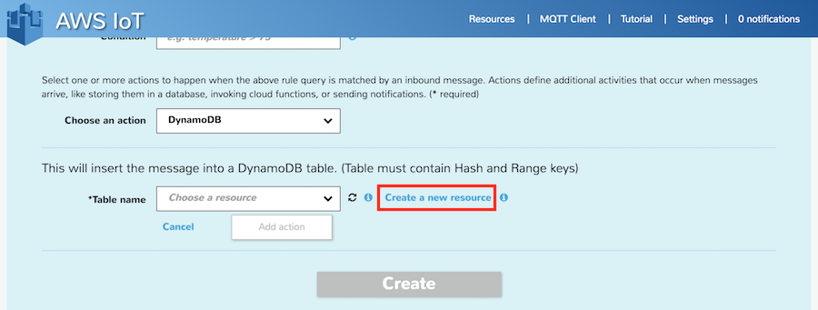

 

別の画面が表示されるので「テーブルの作成」ボタンをクリックします。

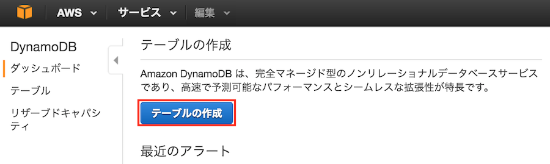

 

DynamoDBの作成画面が表示されました。

テーブル名、パーティションキー、パーティションキーの型を選択し、その下にある「ソートキーの追加」にチェックを付けます。

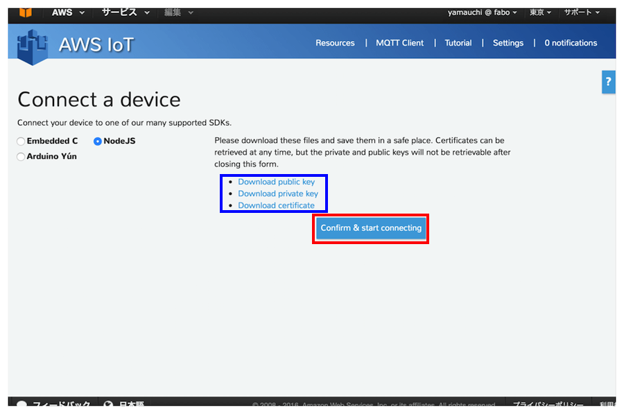

２つ目の項目が表示されるので、名前と型を設定し「作成」ボタンをクリックします。
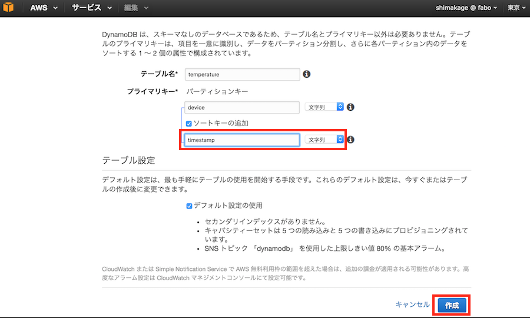

作成を行うとDynamoDBの画面が表示され、今回作成したテーブルが表示されます。

右側にあるタブから「項目」を選択すると、テーブルの項目が表示されます。
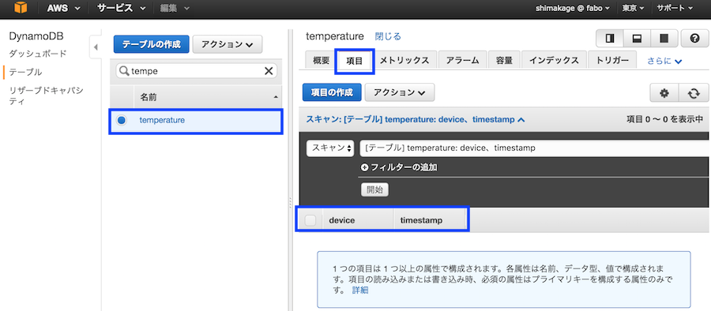

AWS IoTの入力していた画面に戻り、テーブル名の右側にある更新ボタンをクリックし、先ほど作成したテーブルを選択します。

するとテーブルのキー項目に対する設定が表示されます。

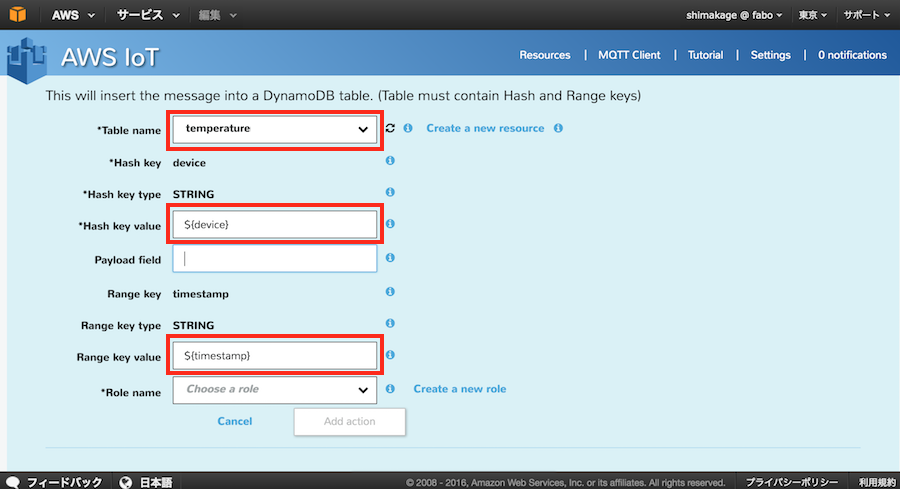

ここでは各項目に設定する内容を記述します。

Hash key valueに設定している内容は、thingから送られてきたdeviceというデータを、テーブルのdeviceの項目に設定するという意味になります。

Range key valueも同様の内容になります。

 

各項目の説明

|項目|説明|設定値|
|:--|:--|:--|
|Table name|データを設定するテーブル名|temperature|
|Hash key value|Key項目に設定する内容|${device}|
|Range key value|Range Keyに設定する内容|${timestamp}|

 

次にロールの作成を行います。

Role nameの右にある「Create a new role」を選択します。

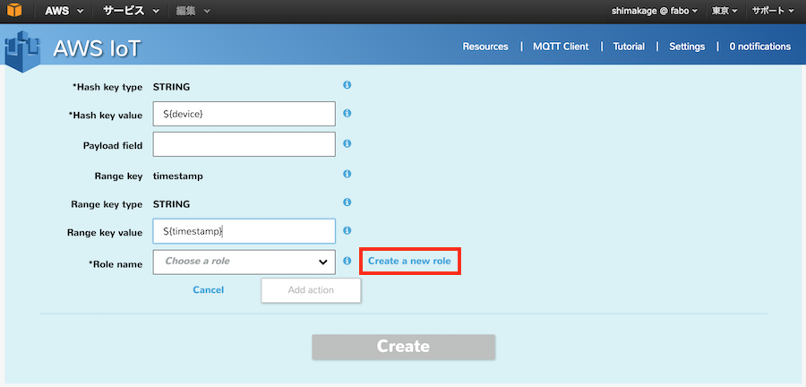

IAMロール、ポリシー名を選択します。

今回は変更無しで許可ボタンをクリックします。

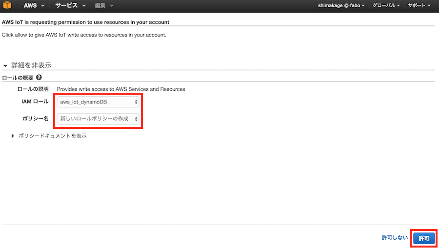

作成したロール名を選択し、Add actionボタンをクリックします。

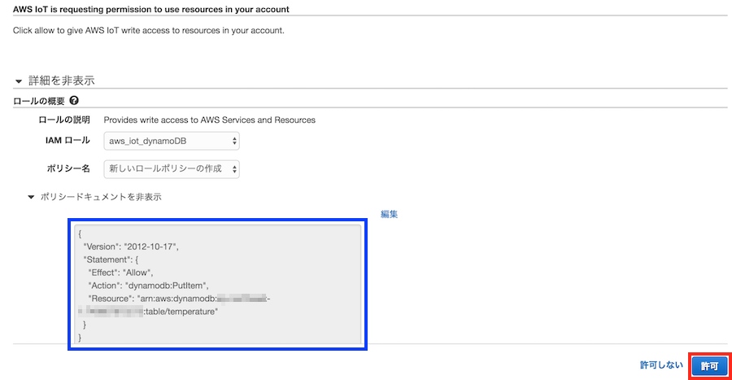

項目の説明

|項目|説明|設定値|
|:--|:--|:--|
|Role name|設定するロール|aws_iot_s3|

 

DynamoDBが追加されました。

ここでCreateをクリックするとルールが作成されます。

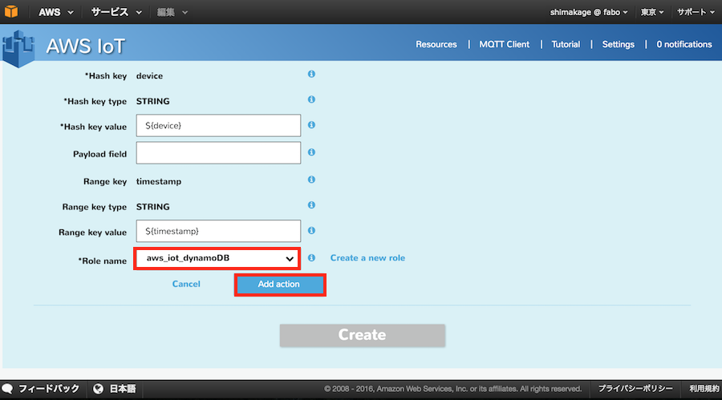

### デバイス接続認証設定

Thingに対して実際に接続するデバイスからの認証情報の設定を行います。

AWS IoTの画面からThingを選択し、表示された詳細から「Connect a device」をクリックします。

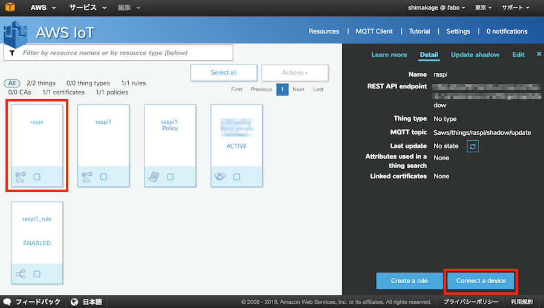

ここでは今回使用するPythonが存在しないので、代わりに「NodeJS」を選択します。

選択後、ボタンが表示されるので記述内容を確認し「Generate certificate and policy」をクリックします。
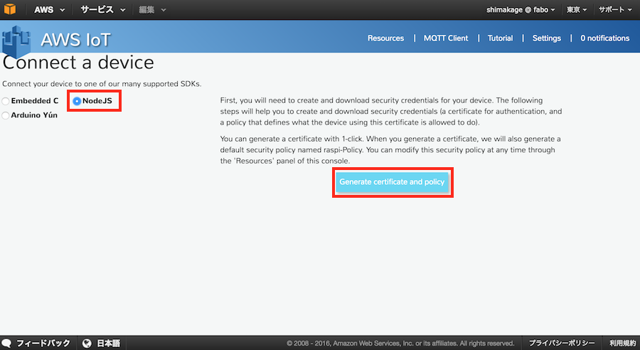

表示された３つのリンクよりファイルをダウンロードします。

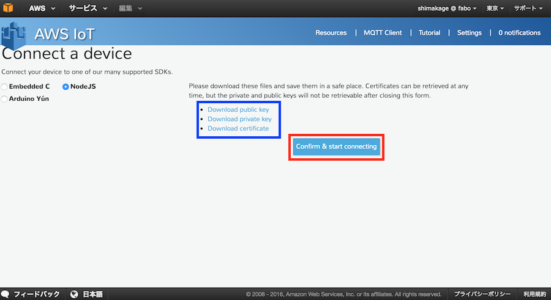

ダウンロードするファイル

|ファイル名|説明|
|:--|:--|
|XXXXXXXXXX-public.pem.key|公開キー|
|XXXXXXXXXX-private.pem.key|秘密キー|
|XXXXXXXXXX-certificate.pem.crt|証明書|

※Publick KeyとPrivate Keyはここでしかダウンロードすることができないので、忘れずにダウンロードしてください。

ダウンロードが完了したら「Confirm & start connecting」をクリックします。

 

次に表示されたテキストボックスの内容は接続時に使用するものになりますので、テキストボックスの内容をコピーして別ファイルに貼り付けて保存しておきます。

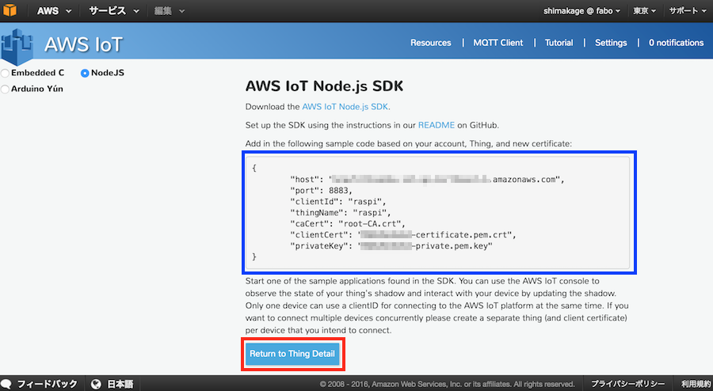

それが終わりましたらReturn to Thing Detailボタンを押します。

これでAWS側のデバイス登録の設定は完了となります。
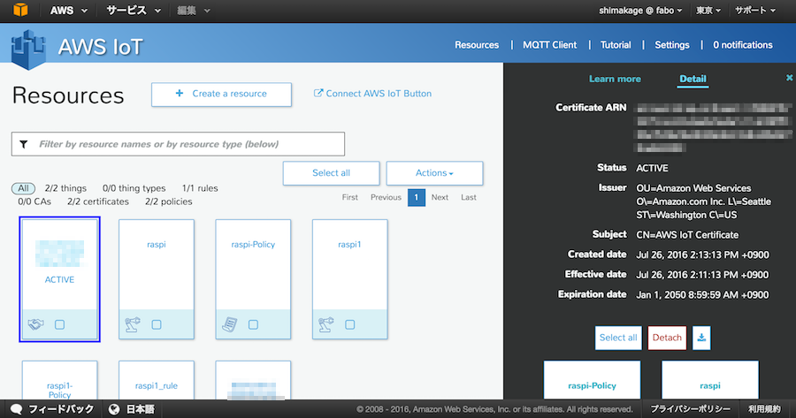
