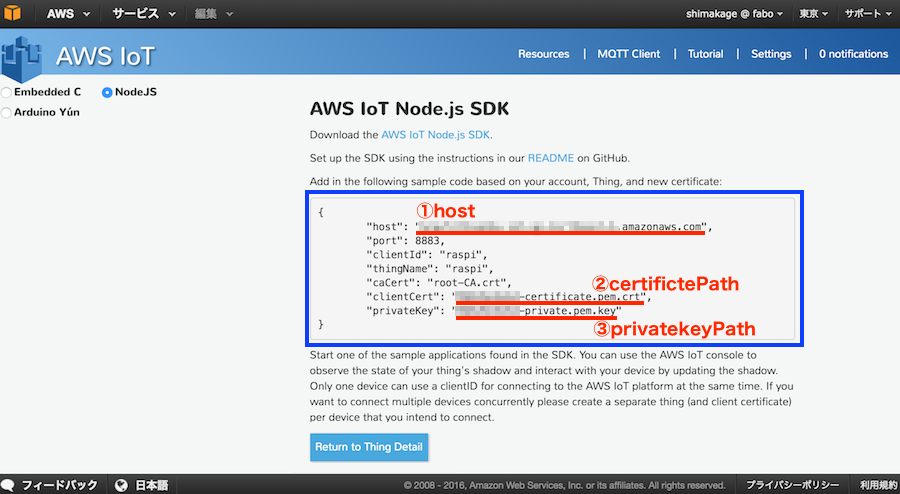
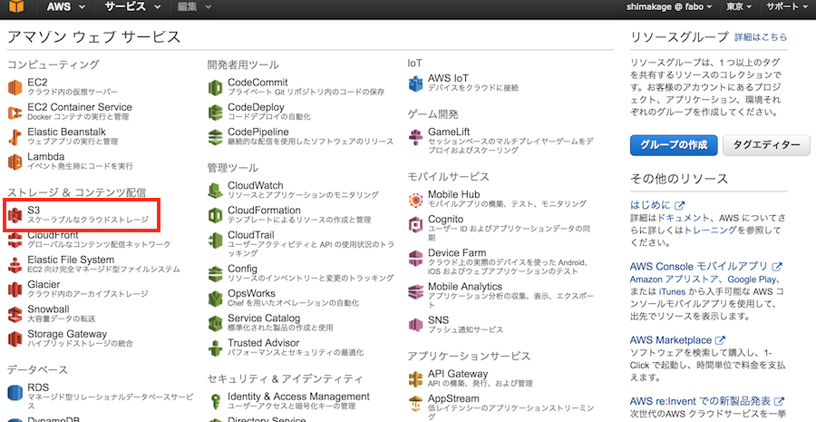
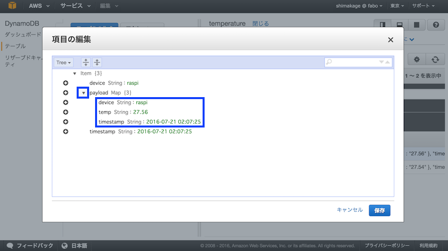

## 温度センサーの値を同期(Python）

ここではI2Cの温度センサーから温度を取得し、その値をAWS IoT側に登録するということを行っていきます。

### Out/In Shieldと温度センサーの接続
RaspberryPIにOut/In Shieldを取り付けます。

Out/In ShieldのI2Cコネクタに#207 Temperature i2c Brickを接続します。


### AWS IoT Device SDK for Pythonのインストール

まずPythonでAWSにデータを登録するために必要な、AWS IoT Device SDKをインストールします。SDKはpipを使用してインストールします。

ターミナルを起動し、下記のコマンドを実行します。

```
sudo pip install AWSIoTPythonSDK
```

### 温度センサー用ライブラリのインストール
次に温度センサーから温度を取得するためのライブラリをインストールします。

下記のコマンドを実行してインストールします。

```
sudo pip install FaBoTemperature_ADT7410
```


### Key、証明書ファイルの準備
サンプルコード実行にあたり、Key情報や証明書のファイルなど、計３つ必要になります。

RaspberryPIにて、今回ファイルを格納するフォルダ「aws」を作成し、その中に「key」というフォルダを作成します。

デバイス接続認証設定でダウンロードしたファイルのうち、以下の２ファイルをRaspberryPiのkeyフォルダに格納します。

* xxxxxxxxxx-certificate.pem.crt
* xxxxxxxxxx-private.pem.key


次に、もうひとつの証明書ファイルを作成します。

keyフォルダに移動し、下記コマンドによりもう一つ証明書ファイルを取得します。

```
curl https://www.symantec.com/content/en/us/enterprise/verisign/roots/VeriSign-Class%203-Public-Primary-Certification-Authority-G5.pem -o rootCA.pem
```

rootCA.pemという名前で保存されます。

#### ディレクトリ構成

```
aws/
  └ key/
      ├ xxxxxxxxxx-certificate.pem.crt (ダウンロードした証明書)
      ├ xxxxxxxxxx-private.pem.key     (プライベートキー)
      └ rootCA.pem                     (コマンドにて取得した証明書)
```


## サンプルコード準備
awsフォルダ内にサンプルコード「aws_temp.py」を作成します。

16行目〜21行目にあるhost、privateKeyPath、certificatePathの項目には「XXXXXX」で記載している箇所があります。


ここは接続設定で下の画面で退避しておいたテキストに合わせて変更して下さい。



<br>

### aws_temp.py

```
#!/usr/bin/env python
# coding: utf-8

from AWSIoTPythonSDK.MQTTLib import AWSIoTMQTTClient
import logging
import time
from time import gmtime, strftime
import json

# I2C 温度センサ用ライブラリ
import FaBoTemperature_ADT7410

# 温度取得用のオブジェクト
adt7410 = FaBoTemperature_ADT7410.ADT7410()

# ①Host設定 AWS IoTのThingのホスト名
host            = "XXXXXXXXXXXXXXXXXX-1.amazonaws.com"
# ②certificateのパス設定
certificatePath = "./key/XXXXXXXXXX-certificate.pem.crt"
# ③private Keyのパス設定
privateKeyPath  = "./key/XXXXXXXXXX-private.pem.key"
# rootCAのパス設定 取得した証明書のパス
rootCAPath      = "./key/rootCA.pem"

# Custom MQTT message callback
def customCallback(client, userdata, message):
        print("Received a new message: ")
        print(message.payload)
        print("from topic: ")
        print(message.topic)
        print("--------------\n\n")

# Configure logging
logger = None
logger = logging.getLogger("AWSIoTPythonSDK.core")  # Python 2
logger.setLevel(logging.DEBUG)
streamHandler = logging.StreamHandler()
formatter = logging.Formatter('%(asctime)s - %(name)s - %(levelname)s - %(message)s')
streamHandler.setFormatter(formatter)
logger.addHandler(streamHandler)

# Init AWSIoTMQTTClient
myAWSIoTMQTTClient = None
# Thingに設定した名前
myAWSIoTMQTTClient = AWSIoTMQTTClient("raspi")
# Port
myAWSIoTMQTTClient.configureEndpoint(host, 8883)
# 証明書のパス
myAWSIoTMQTTClient.configureCredentials(rootCAPath, privateKeyPath, certificatePath)

# AWSIoTMQTTClient connection configuration
myAWSIoTMQTTClient.configureAutoReconnectBackoffTime(1, 32, 20)
myAWSIoTMQTTClient.configureOfflinePublishQueueing(-1)  # Infinite offline Publish queueing
myAWSIoTMQTTClient.configureDrainingFrequency(2)  # Draining: 2 Hz
myAWSIoTMQTTClient.configureConnectDisconnectTimeout(10)  # 10 sec
myAWSIoTMQTTClient.configureMQTTOperationTimeout(5)  # 5 sec

# Connect and subscribe to AWS IoT
myAWSIoTMQTTClient.connect()
time.sleep(2)

while True:
    # 温度データ取得
    temp = "{0:.2f}".format(adt7410.read())
    # タイムスタンプ(local time)の文字列作成 
    timestamp = strftime('%Y-%m-%d %H:%M:%S', localtime())
    # 送信データ設定
    record = {
        "device": "raspi",
        "timestamp": timestamp,
        "temp": temp
    }
    # データ変換
    jstr = json.dumps(record)
    # データ送信 tempというTopicに送信
    myAWSIoTMQTTClient.publish("temp", str(jstr), 1)
    # 送信データのログ出力
    print jstr

    # 今回はサンプルのため10秒毎に送信
    time.sleep(10)

```

### 実行

実行前のディレクトリ構成はこのようになります。

```
aws/
  ├ aws_temp.py (サンプルプログラム）
  └ key/
      ├ xxxxxxxxxx-certificate.pem.crt (ダウンロードした証明書)
      ├ xxxxxxxxxx-private.pem.key     (プライベートキー)
      └ rootCA.pem                     (コマンドにて取得した証明書)
```

awsフォルダに移動し、下記のコマンドによりサンプルコードを実行します。

```
python aws_temp.py
```

実行後、いくつかログ表示されたあと、下記のようなログが表示されます。

```
{"device": "raspi", "timestamp":"XXXX-XX-XX XX:XX:XX", "temp": "XX.XX"}
```

このログが２回ほど表示されたら、Controlキー＋Cで処理を終了します。


### 結果確認

AWSのホーム画面から「DynamoDB」を選択します。



DynamoDBの画面が表示されるので、テーブル>temperature>項目と選択していくと、今回作成したデータが表示されます。

詳細を表示するには、対象データのdevice名の「raspi」をクリックします。


payloadの項目をクリックすることで、送信した温度データを確認することができます。


